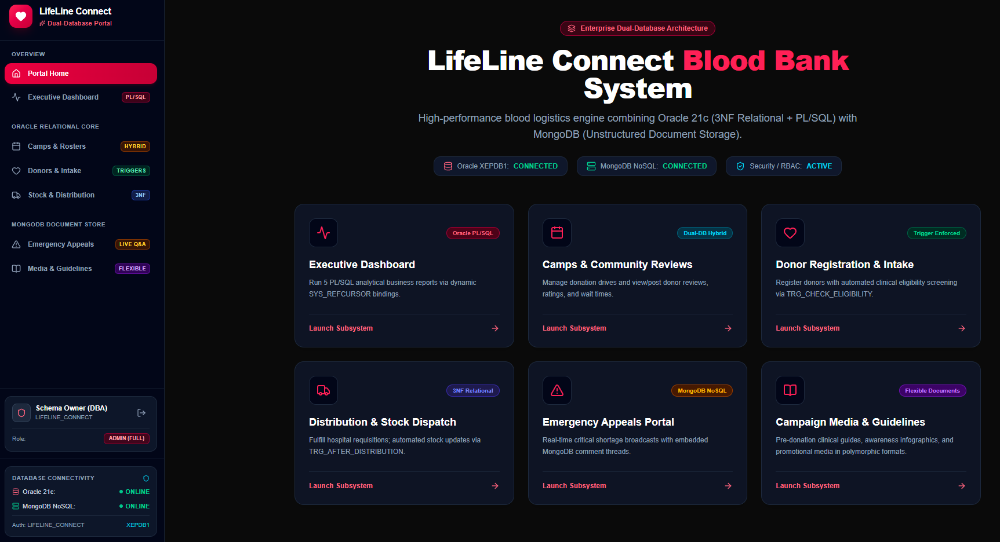
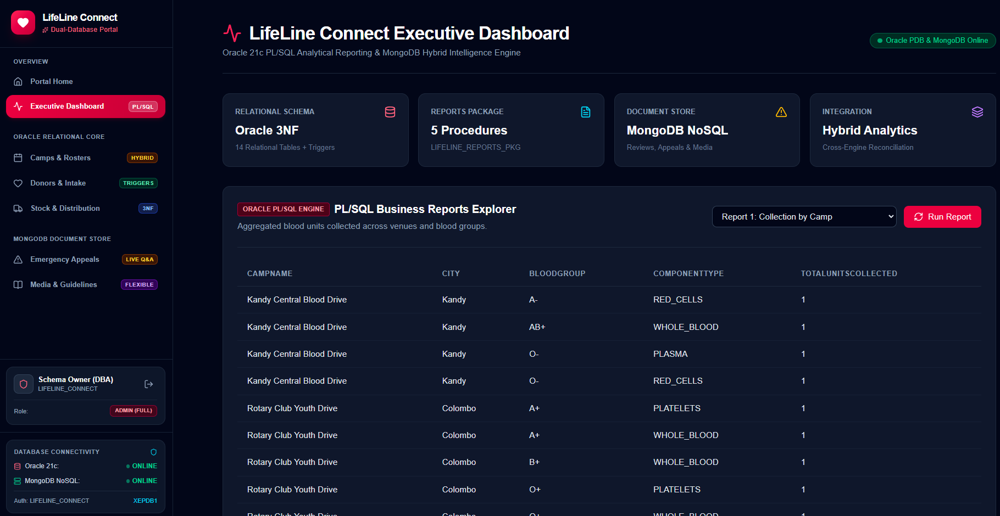
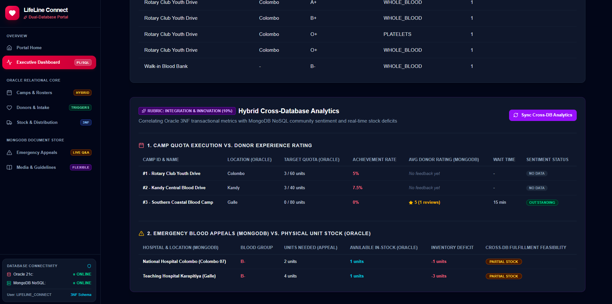
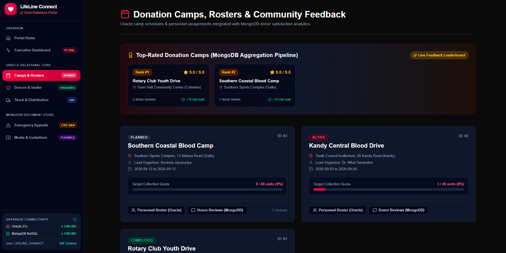
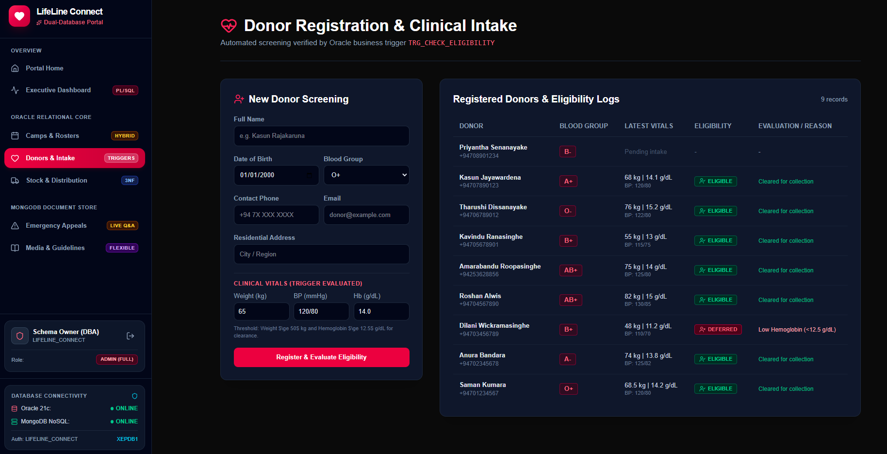
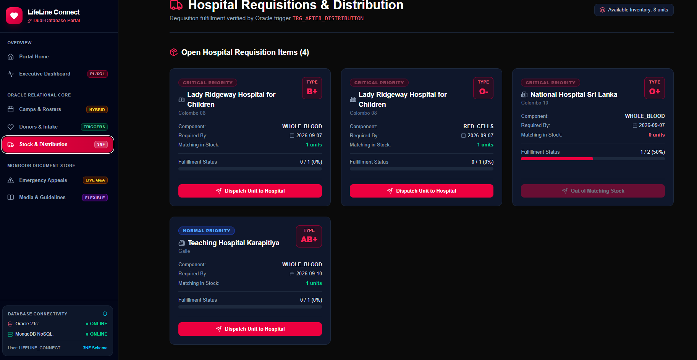
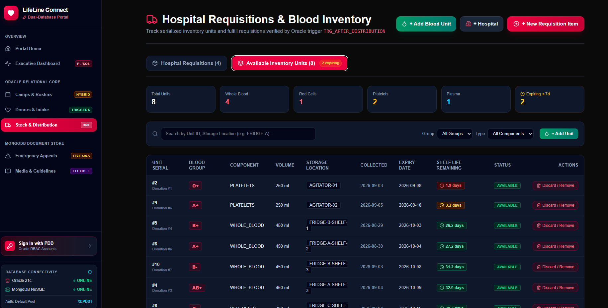
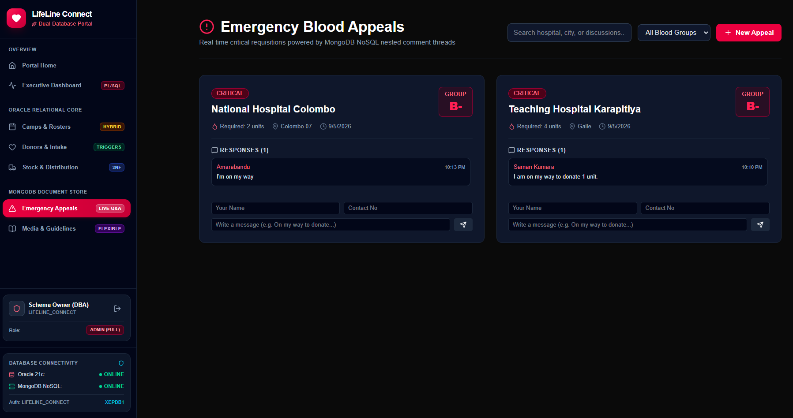
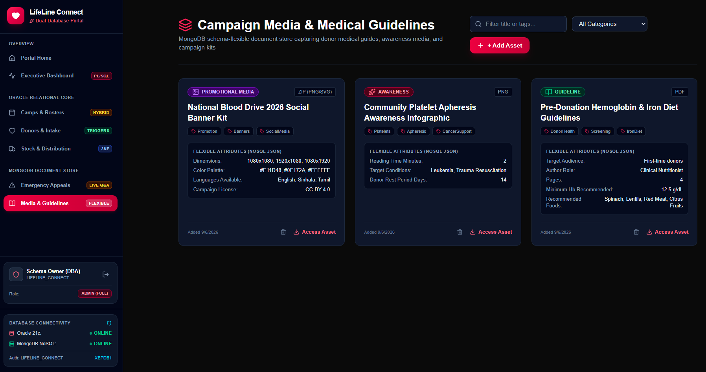
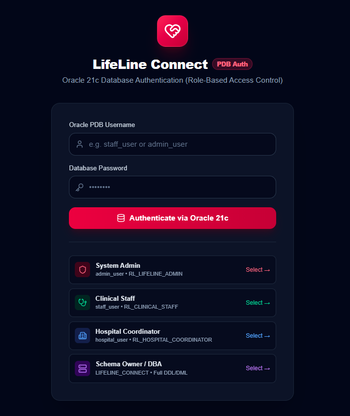

# LifeLine Connect: Central Blood Bank & Logistics Network

**Course**: Higher Diploma in Software Engineering (HDSE)  
**Module**: Data Management 2 (CW1)  
**Institution**: National Institute of Business Management (NIBM)  
**Architecture**: Enterprise Dual-Database System (Oracle Database 21c + MongoDB NoSQL)  

---

## 📌 Executive Summary

**LifeLine Connect** is an enterprise-grade central blood bank network and donation logistics portal designed to facilitate regional blood donation camps, manage donor eligibility screening, track live component inventory, and streamline emergency hospital distribution.

The solution integrates a **dual-database hybrid architecture**:
1. **Oracle Database 21c (Relational 3NF + PL/SQL)**: Enforces strict ACID compliance, relational integrity, clinical constraint checking, audit triggers, and 5 analytical business reports via `SYS_REFCURSOR`.
2. **MongoDB NoSQL (Unstructured Document Store)**: Captures schema-flexible pre-donation medical guidelines, campaign awareness media, donor reviews with aggregation pipelines, and real-time emergency blood appeal discussion threads.

---

## 🏛️ System Architecture

```
+-----------------------------------------------------------------------+
|                    LIFELINE CONNECT WEB PORTAL                        |
|                  (Next.js 15 • TypeScript • Tailwind CSS)             |
+-----------------------------------+-----------------------------------+
                                    |
            +-----------------------+-----------------------+
            |                                               |
            v                                               v
+-----------------------------------+   +-------------------------------+
|       ORACLE DATABASE 21c         |   |         MONGODB NOSQL         |
|    (ACID Core Relational Engine)  |   |   (Polymorphic Document Store)|
+-----------------------------------+   +-------------------------------+
| • 14 Normalized Relational Tables |   | • Campaign Awareness Media    |
| • 4 Autonomous Database Triggers  |   | • Donor Medical Guidelines    |
| • 5 PL/SQL Analytical Reports     |   | • Camp Donor Reviews & Ratings|
| • Role-Based Access Control (RBAC)|   | • Top-Rated Aggregation ($avg)|
| • Data Pump expdp/impdp Recovery  |   | • Emergency Appeal Broadcasts |
+-----------------------------------+   +-------------------------------+
```

---

## 📸 System Interface & UI Walkthrough

The portal provides an intuitive, high-performance dark-themed management interface with a centralized left navigation bar, live database connectivity indicators, and sub-system modules:

### 1. Dual-Database Portal Dashboard & Subsystems
> **Overview & Navigation Shell**: Central landing interface presenting live status indicators for Oracle Database 21c and MongoDB NoSQL, alongside quick-access cards to core operational subsystems and active DBA session identity.



---

### 2. Executive Dashboard & PL/SQL Business Reports Explorer
> **Coursework Rubric (15%)**: Interactive interface executing `LIFELINE_REPORTS_PKG` procedures via dynamic `SYS_REFCURSOR` queries. Allows examiners to trigger all 5 business reports with 1-click test parameters.



---

### 3. Cross-Database Hybrid Analytics & Correlation Engine
> **Coursework Innovation (10%)**: Unifies structured Oracle transactional tables with dynamic MongoDB collections to compute real-time correlations—such as Camp Target Quotas vs. Donor Rating Scores, and Active Emergency Appeals vs. Physical Stock Availability.



---

### 4. Blood Donation Camps & Real-time NoSQL Leaderboard
> **MongoDB Aggregation Pipeline**: Camp scheduling and medical roster management paired with a real-time Top-Rated Camps leaderboard computed via a MongoDB aggregation pipeline (`$group` with `$avg` rating).



---

### 5. Donor Registration & Automated Clinical Intake Screening
> **PL/SQL Health Assessment Trigger (`TRG_EVALUATE_DONOR_HEALTH`)**: Medical officers record donor vital metrics (Weight, Hemoglobin, Blood Pressure). The database trigger autonomously computes eligibility (`ELIGIBLE` vs `DEFERRED`) and logs clinical deferral reasons.



---

### 6. Hospital Requisitions & 3NF Blood Unit Distribution Engine
> **Relational Distribution Trigger (`TRG_AFTER_DISTRIBUTION`)**: Manages 3NF hospital requests, line-item fulfillment, and physical unit dispatching while automatically updating inventory status to `DISTRIBUTED`.



---

### 7. Serialized Component Inventory & Auto-Computed Shelf Life
> **Database Trigger Shelf Life Tracking (`TRG_SET_UNIT_EXPIRY`)**: Comprehensive component inventory dashboard displaying serialized unit batches, remaining days until expiry, storage compartments (e.g. Agitators, Specialized Cold Storage Fridges), and urgent expiration warning counters.



---

### 8. Real-Time Emergency Appeals & Community Response Network
> **MongoDB Nested Discussion Threads**: Urgent blood shortage broadcasts issued by regional hospitals, featuring live community response threads, pledge logging, and real-time interaction.



---

### 9. Campaign Media & Medical Guidelines Document Store
> **Polymorphic NoSQL Document Store**: Flexible catalog for donor medical guidelines, nutrition pamphlets, and promotional awareness kits with varied schema metadata (color palettes, reading times, dietary rules).



---

### 10. Oracle 21c Database Authentication & Role-Based Access Control (RBAC)
> **Direct Oracle PDB Security**: Examiners and users authenticate directly against Oracle Pluggable Database (`XEPDB1`) using database user accounts (`admin_user`, `staff_user`, `hospital_user`, `LIFELINE_CONNECT`). Features 1-click test credentials selector and dynamic role permission resolution (`USER_ROLE_PRIVS`).




---

## 🗄️ Relational Schema & Normalization (Oracle 3NF)

The relational schema consists of **14 normalized entities** in Third Normal Form (3NF), complete with Primary Keys, Foreign Keys, unique constraints, and check conditions:

1. **VENUE**: Camp hosting facilities with capacity bounds.
2. **STAFF**: Medical officers, phlebotomists, and administrators (Managed via **[Personnel Hub `/staff`](file:///c:/Users/gayan/OneDrive/Documents/EDU/NIBM/HDSE/sem-2/dm-2/Course_Work/lifeline-connect/app/staff/page.tsx)**).
3. **VOLUNTEER**: Community assistants tracked with contact details and competencies (Managed via **[Personnel Hub `/staff`](file:///c:/Users/gayan/OneDrive/Documents/EDU/NIBM/HDSE/sem-2/dm-2/Course_Work/lifeline-connect/app/staff/page.tsx)**).
4. **CAMP**: Blood donation drives with scheduled dates, organizers, and target quotas.
5. **CAMP_STAFF**: M:N associative junction for medical staff camp duty assignments (Managed & tracked via **[Personnel Hub `/staff`](file:///c:/Users/gayan/OneDrive/Documents/EDU/NIBM/HDSE/sem-2/dm-2/Course_Work/lifeline-connect/app/staff/page.tsx)** & **[Camps & Rosters `/camps`](file:///c:/Users/gayan/OneDrive/Documents/EDU/NIBM/HDSE/sem-2/dm-2/Course_Work/lifeline-connect/app/camps/page.tsx)**).
6. **CAMP_VOLUNTEER**: M:N associative junction for community volunteer duty assignments (Managed & tracked via **[Personnel Hub `/staff`](file:///c:/Users/gayan/OneDrive/Documents/EDU/NIBM/HDSE/sem-2/dm-2/Course_Work/lifeline-connect/app/staff/page.tsx)** & **[Camps & Rosters `/camps`](file:///c:/Users/gayan/OneDrive/Documents/EDU/NIBM/HDSE/sem-2/dm-2/Course_Work/lifeline-connect/app/camps/page.tsx)**).
7. **DONOR**: Voluntary donor profiles and blood groups (Managed via **[Donor Hub `/donors`](file:///c:/Users/gayan/OneDrive/Documents/EDU/NIBM/HDSE/sem-2/dm-2/Course_Work/lifeline-connect/app/donors/page.tsx)**).
8. **DONOR_HEALTH**: Point-in-time clinical screenings (weight, hemoglobin, blood pressure).
9. **DONATION**: Donation events; supports walk-ins (CampID = NULL) and mobile drives.
10. **BLOOD_UNIT**: Serialized component inventory packets with auto-computed shelf life.
11. **HOSPITAL**: Regional medical centers and emergency wards.
12. **BLOOD_REQUEST**: Hospital requisition headers categorized by clinical priority.
13. **REQUEST_ITEM**: Requisition line items tracking requested vs. fulfilled units.
14. **DISTRIBUTION**: Dispatch records linking individual blood units to hospital line items.


---

## ⚙️ PL/SQL Business Logic: Triggers & Reports

### Autonomous Database Triggers
Located in `resourses/db.sql`:
* **`TRG_SET_UNIT_EXPIRY`** (`BEFORE INSERT ON BLOOD_UNIT`): Auto-computes unit shelf life based on component type (Platelets: +5 days, Whole Blood: +35 days, Red Cells: +42 days, Plasma: +365 days).
* **`TRG_AFTER_DISTRIBUTION`** (`AFTER INSERT ON DISTRIBUTION`): Updates physical unit status to `DISTRIBUTED`, increments `REQUEST_ITEM.UnitsFulfilled`, and updates `BLOOD_REQUEST.Status` to `PARTIAL` or `FULFILLED`.
* **`TRG_CHECK_ELIGIBILITY`** (`BEFORE INSERT ON DONATION`): Rejects donations if the associated donor health screening record has `Eligible = 'N'`.
* **`TRG_EVALUATE_DONOR_HEALTH`** (`BEFORE INSERT OR UPDATE ON DONOR_HEALTH`): Evaluates vital metrics autonomously (Weight $< 50$ kg or Hemoglobin $< 12.5$ g/dL marks `Eligible = 'N'` and assigns clinical deferral reasons).

### Five (05) Analytical Business Reports
Encapsulated within `LIFELINE_REPORTS_PKG` returning dynamic `SYS_REFCURSOR` objects:
1. **Report 1: Total Units Collected by Camp & Group** (`GET_UNITS_COLLECTED_BY_CAMP`)
2. **Report 2: Expiring Inventory Forecasting** (`GET_EXPIRING_INVENTORY(p_days_ahead)`)
3. **Report 3: Individual Donor History & Eligibility** (`GET_DONOR_HISTORY_REPORT(p_donor_id)`)
4. **Report 4: Hospital Requisition Fulfillment & Shortages** (`GET_HOSPITAL_FULFILLMENT_REPORT`)
5. **Report 5: Camp Target Achievement & Performance** (`GET_CAMP_PERFORMANCE_REPORT`)

---

## 🍃 MongoDB Integration & Aggregation Queries

MongoDB serves as a complementary NoSQL database for unstructured and polymorphic content:
* **Campaign Media & Medical Guidelines (`CampaignMedia`)**: Stores pre-donation medical guidelines, campaign awareness materials, and promotional banner kits with flexible, polymorphic metadata (reading times, target audience, color palettes, dietary recommendations).
* **Donor Reviews & Experience Feedback (`Review`)**: Captures donor ratings (1–5 stars), qualitative feedback, and waiting times.
* **Top-Rated Camps Query**: Uses a multi-stage aggregation pipeline (`$group` $\rightarrow$ `$sort` $\rightarrow$ `$limit` $\rightarrow$ `$project`) to compute real-time leaderboards.
* **Emergency Blood Appeals (`Appeal`)**: Real-time hospital shortage broadcasts with embedded, interactive community response discussion threads.

---

## 🔒 Database Administration & Security (RBAC)

Located in `resourses/user.sql`:
* **Schema Owner**: `LIFELINE_CONNECT` with unlimited quota and administrative system privileges.
* **Role-Based Access Control (RBAC)**:
  * **`RL_CLINICAL_STAFF`**: DML on `DONOR`, `DONOR_HEALTH`, `DONATION`, `BLOOD_UNIT`; read-only on `CAMP` and `VENUE`; execute on reports package.
  * **`RL_HOSPITAL_COORDINATOR`**: DML on `BLOOD_REQUEST`, `REQUEST_ITEM`, `DISTRIBUTION`; read-only on inventory.
  * **`RL_LIFELINE_ADMIN`**: Complete administrative control over all 14 schema tables and packages.
* **User Accounts**: `admin_user`, `staff_user`, and `hospital_user` configured under the Principle of Least Privilege.
* **Direct Oracle PDB Portal Authentication (`/login`)**:
  * Users authenticate directly against Oracle Pluggable Database (`XEPDB1`) using their database credentials.
  * The Next.js backend inspects granted roles via Oracle data dictionary (`USER_ROLE_PRIVS`).
  * The portal navigation dynamically adapts: modules outside the user's role privilege are visually locked with an **RBAC Lock** indicator, demonstrating role enforcement in viva presentations.


### Disaster Recovery & Backup Plan
* **Automated Backup**: [resourses/backup_strategy.bat](file:///c:/Users/gayan/OneDrive/Documents/EDU/NIBM/HDSE/sem-2/dm-2/Course_Work/lifeline-connect/resourses/backup_strategy.bat) exports the Oracle schema via Data Pump (`expdp`) and dumps MongoDB collections via `mongodump`.
* **Automated Restore**: [resourses/restore_strategy.bat](file:///c:/Users/gayan/OneDrive/Documents/EDU/NIBM/HDSE/sem-2/dm-2/Course_Work/lifeline-connect/resourses/restore_strategy.bat) recovers Oracle PDB via `impdp table_exists_action=REPLACE` and restores MongoDB via `mongorestore --drop`.

---

## 🚀 Getting Started

### 1. Prerequisites
* **Oracle Database 21c XE** (PDB: `XEPDB1`)
* **MongoDB Server** (Community Edition v6.0+)
* **Node.js** (v18.x or v20.x) & `npm`

### 2. Configure Environment Variables
Create `.env.local` in the project root:
```env
# Oracle Connection
ORACLE_USER=LIFELINE_CONNECT
ORACLE_PASSWORD=LifeLine2026
ORACLE_CONN_STR=localhost:1521/XEPDB1

# MongoDB Connection
MONGODB_URI=mongodb://localhost:27017/lifeline_nosql
```

### 3. Initialize Oracle Database
Open SQL*Plus as `SYSDBA`:
```sql
@resourses/user.sql
CONNECT LIFELINE_CONNECT/LifeLine2026@localhost:1521/XEPDB1;
@resourses/db.sql
```

### 4. Install & Launch Application
```bash
# Install dependencies
npm install

# Start development server
npm run dev
```
Open **[http://localhost:3000](http://localhost:3000)** in your browser.

---
